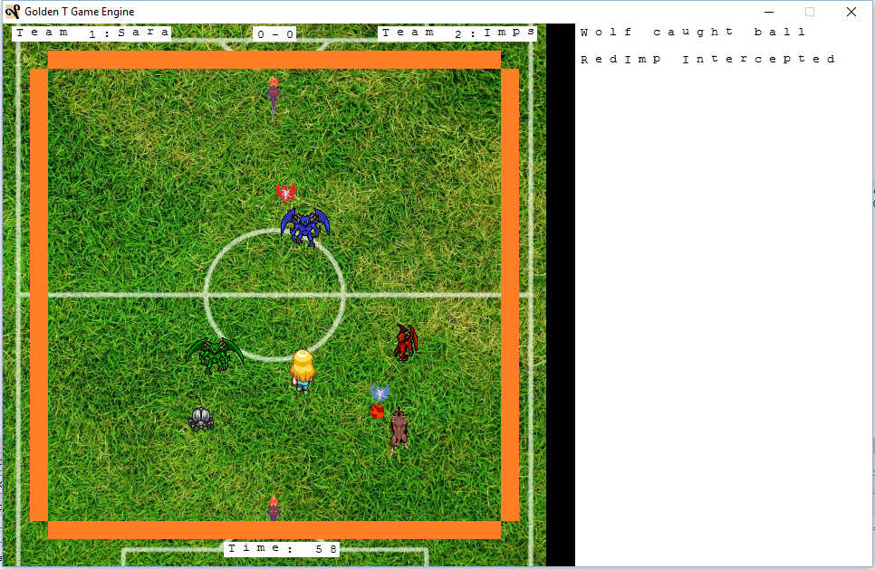
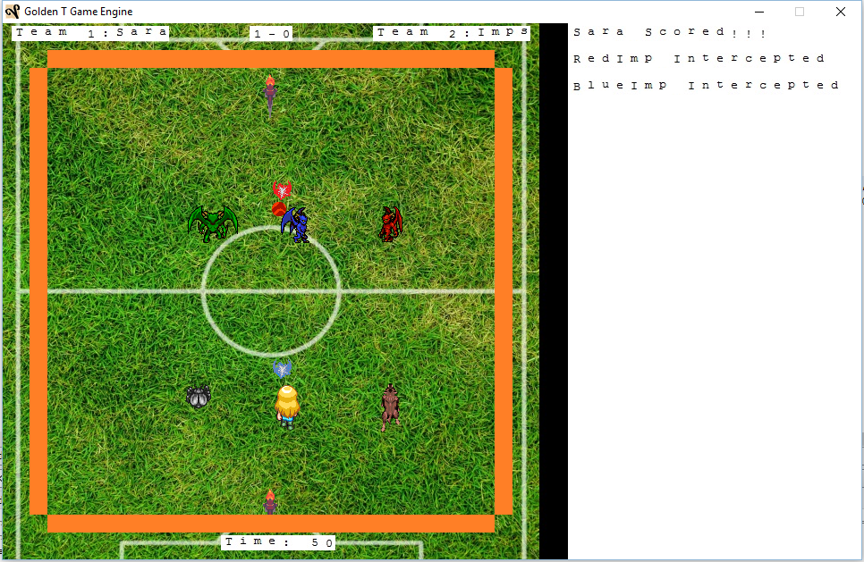
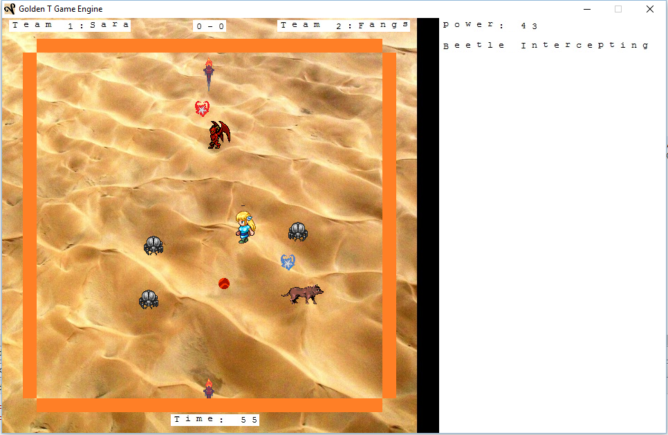
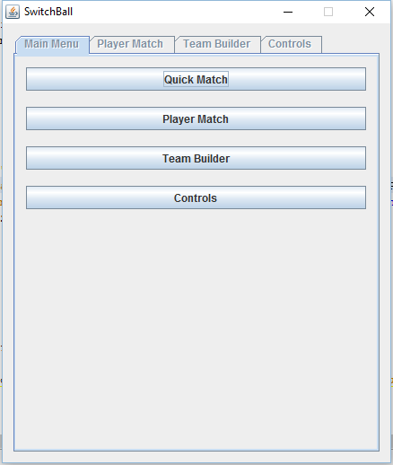
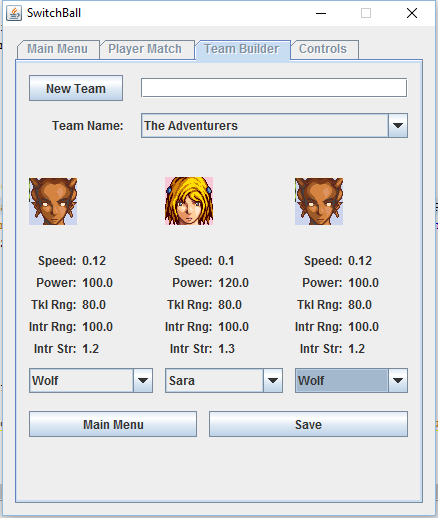

# switchball

This a basketball like computer game built for my final year college project.

---

- Java as the programming langauge.
- Netbeans for the IDE.
- GTGE for the game engine.
- Jinput to access game controllers.

---

---

This project used open source assets from the following domains:

- https://pixabay.com/
- http://kenney.nl/
- http://opengameart.org/